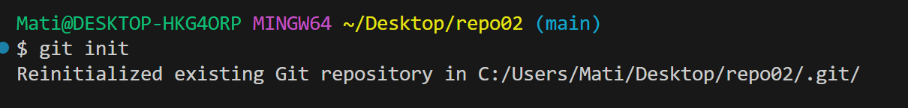
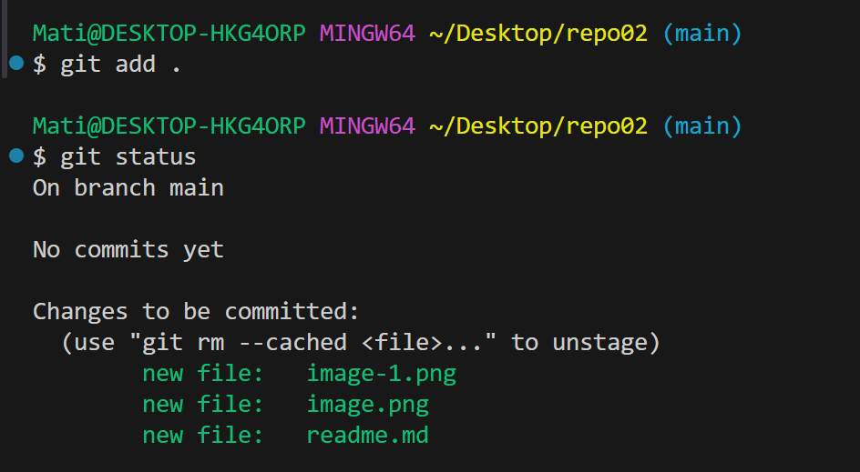
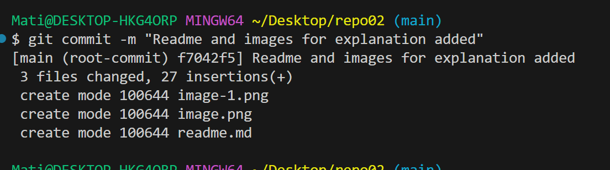
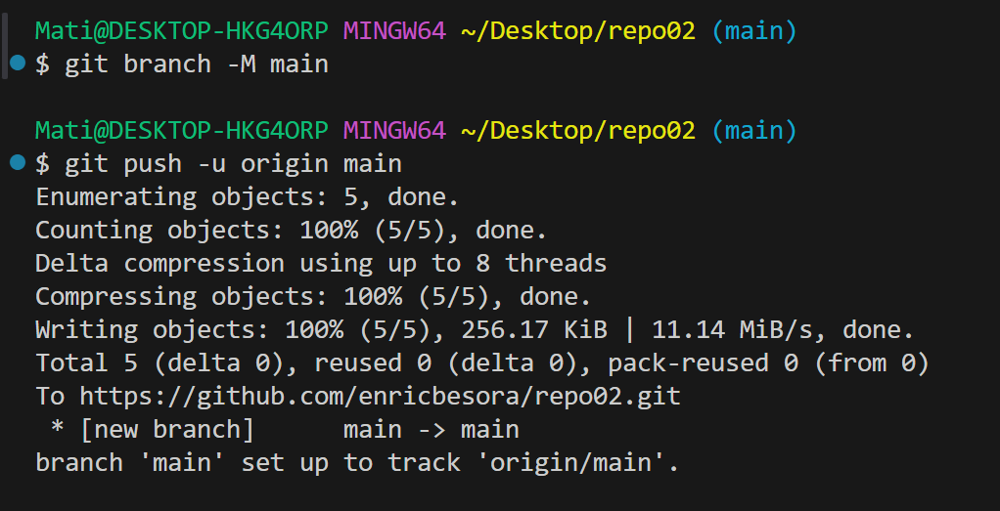
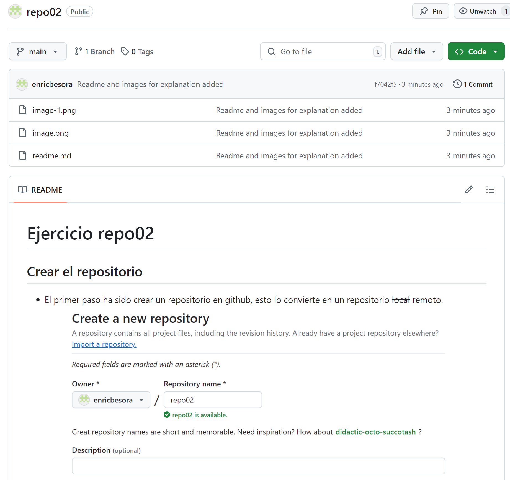

# Ejercicio repo02

## Crear el repositorio
- El primer paso ha sido crear un repositorio en github, esto lo convierte en un repositorio ~~local~~ remoto.

- Para poder tener el repositorio en nuestro pc, primero tenemos que clonar el repositorio de git y despues acceder a el.

## Tareas restantes
- [x] Crear repositorio remoto
- [x] Clonar archivos a nuestro pc
- [x] Readme creado
- [ ] Añadir archivos al commit
- [ ] Hacer el commit local
- [ ] Hacer el push al remoto
- [ ] Comprovar que nada esta en llamas🔥

## Crear el commit y hacer el push

- Primero de todo empezaremos el repositorio local con git init (aunque en este caso no haria falta ya que hemos creado el repositorio de forma remota).
    

- Para hacer el commit primero necesitamos hacer un add . para añadir todos los cambios realizados a la carpeta (readme e imagenes).
    

- Despues podemos añadir todo al commit local con un mensaje con el cambio que hemos hecho, en este caso crear el readme y añadir imagenes.
    

- Seguidamente comprovaremos que estamos en la rama correspondiente con el git branch y despues podremos hacer el push.
    

- Finalmente podremos comprovar que todo ha salido bien y el readme se lee correctamente desde el github. 
    

## Tareas finales
- [x] Crear repositorio remoto
- [x] Clonar archivos a nuestro pc
- [x] Readme creado
- [x] Añadir archivos al commit
- [x] Hacer el commit local
- [x] Hacer el push al remoto
- [x] Comprovar que nada esta en llamas🔥