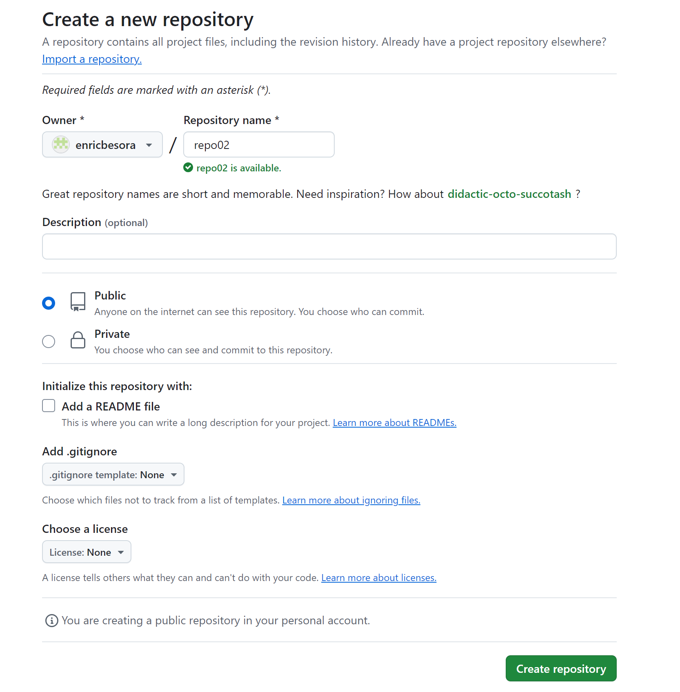
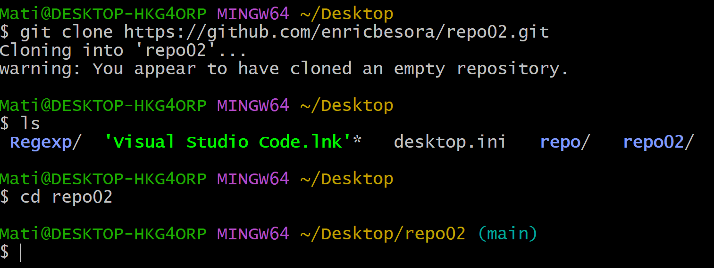

# Ejercicio repo02

## Crear el repositorio
- El primer paso ha sido crear un repositorio en github, esto lo convierte en un repositorio ~~local~~ remoto.

- Para poder tener el repositorio en nuestro pc, primero tenemos que clonar el repositorio de git y despues acceder a el.

## Tareas
- [x] Crear repositorio remoto
- [x] Clonar archivos a nuestro pc
- [x] Readme creado
- [ ] Añadir archivos al commit
- [ ] Hacer el commit local
- [ ] Hacer el push al remoto
- [ ] Comprovar que nada esta en llamas🔥

## Crear el commit y hacer el push

- Para hacer el commit primero necesitamos hacer un add . para añadir todos los cambios realizados a la carpeta (readme e imagenes)

- Despues podemos añadir todo al commit local con un mensaje con el cambio que hemos hecho, en este caso crear el readme y añadir imagenes.
  

- Finalmente podremos hacer el push al directorio remoto en github y comprovar que todo ha salido bien. 
  
